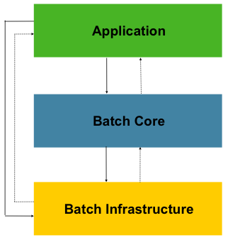
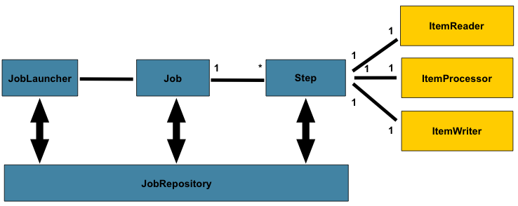
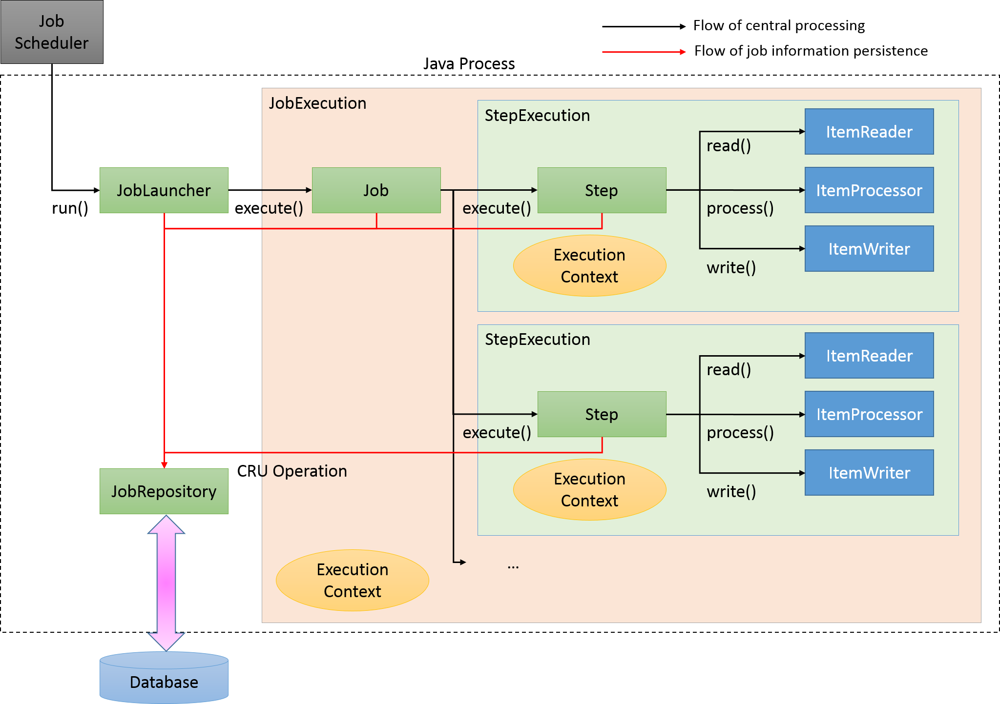
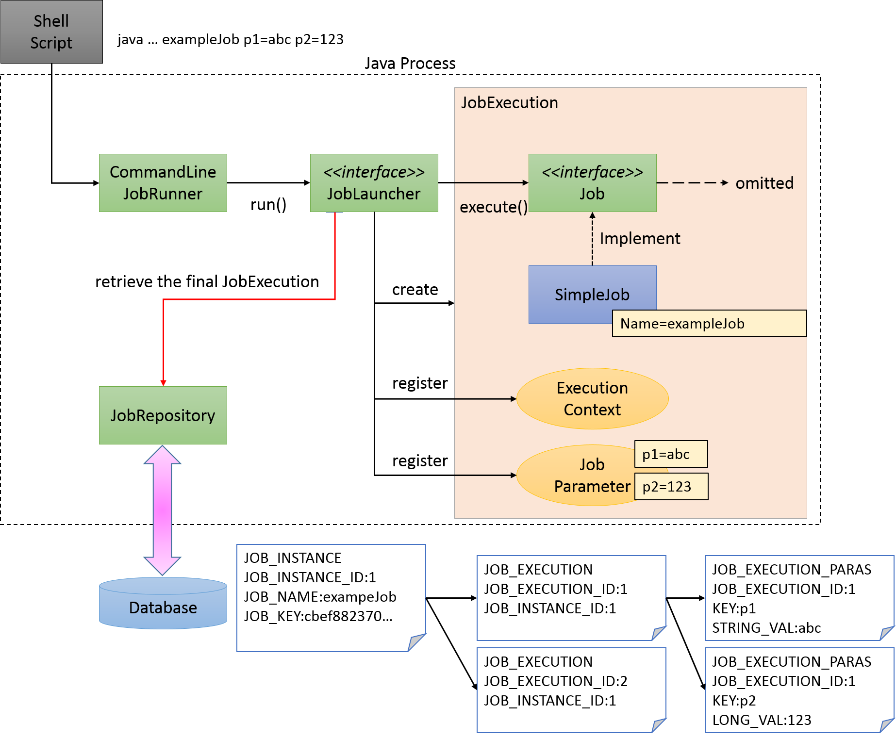

# Spring Batch 개념 정리

---

## 목차

1. [배치(Batch)란 무엇인가](#1-배치batch란-무엇인가)
2. [Scheduler와 Spring Batch는 다른가?](#2-scheduler와-spring-batch는-다른가)
3. [왜 이 서비스에 Spring Batch를 도입했는가](#3-왜-이-서비스에-spring-batch를-도입했는가)
4. [Spring Batch 핵심 도메인 개념](#4-spring-batch-핵심-도메인-개념)
   - 4.1 [전체 구조](#41-전체-구조)
   - 4.2 [구성 요소 상세](#42-구성-요소-상세)
   - 4.3 [Job / JobInstance / JobExecution / JobParameters](#43-job--jobinstance--jobexecution--jobparameters)
   - 4.4 [Step / StepExecution](#44-step--stepexecution)
   - 4.5 [Chunk-Oriented Processing 상세](#45-chunk-oriented-processing-상세)
5. [이 서비스의 Spring Batch 흐름](#5-이-서비스의-spring-batch-흐름)
   - 5.1 [개요](#51-개요)
   - 5.2 [전체 흐름도](#52-전체-흐름도)
   - 5.3 [ItemReader — ApprovalItemReader](#53-itemreader--approvalitemreader)
   - 5.4 [ItemProcessor — SettlementItemProcessor](#54-itemprocessor--settlementitemprocessor)
   - 5.5 [ItemWriter — SettlementItemWriter](#55-itemwriter--settlementitemwriter)
6. [정산 상태 전이](#6-정산-상태-전이)
7. [실행 방법](#7-실행-방법)
8. [Spring Batch 메타 테이블](#8-spring-batch-메타-테이블)
9. [FAQ](#9-faq)
10. [References](#10-references)

---

## 1. 배치(Batch)란 무엇인가

### 실시간 처리 vs 배치 처리

우리가 흔히 사용하는 API는 **실시간(Online) 처리** 방식이다.
사용자가 요청하면 즉시 응답한다.

하지만 모든 작업을 실시간으로 처리할 수 없다. 예를 들어:

- 카드사가 하루 수백만 건의 결제를 정산해야 할 때
- 은행이 자정에 모든 계좌의 이자를 계산해야 할 때
- 쇼핑몰이 매월 1일 구독 요금을 일괄 청구해야 할 때

이런 경우 **배치(Batch) 처리**를 사용한다.

> **배치 처리**란, 대량의 데이터를 정해진 시간에 일괄로 처리하는 방식이다.
> "batch"는 영어로 "한 묶음"이라는 뜻이다.

### 배치 처리의 특징

| 구분 | 실시간(API) 처리 | 배치 처리 |
|------|-----------------|-----------|
| 실행 시점 | 사용자 요청 즉시 | 정해진 시간 (예: 새벽 1시) |
| 처리 단위 | 1건씩 즉시 | 수천~수백만 건을 묶어서 |
| 응답 속도 | 빠름 (ms 단위) | 느려도 됨 (분~시간 단위) |
| 주요 목적 | 즉각적인 피드백 | 대량 데이터 일괄 처리 |
| 예시 | 카드 결제 승인 | 가맹점 정산, 이자 계산 |

---

## 2. Scheduler와 Spring Batch는 다른가?

**결론: 역할이 다르다. 함께 사용한다.**

### Scheduler (스케줄러)

> "언제 실행할지" 를 담당한다.

```java
// SettlementScheduler.java
@Scheduled(cron = "0 0 1 * * *")  // 매일 새벽 1시
public void runScheduled() {
    run(LocalDate.now().minusDays(1));
}
```

- `@Scheduled`로 특정 시간에 메서드를 자동 호출하는 **"트리거(방아쇠)"** 역할이다.
- Scheduler 자체는 "무엇을 어떻게 처리할지" 모른다. 단순히 특정 시간에 메서드를 호출할 뿐이다.
- `@Scheduled`는 `spring-context`에 포함되어 있고, `spring-boot-starter-web`이 전이적으로 포함하기 때문에 별도 의존성 없이 쓸 수 있다. 단, `@EnableScheduling`이 선언되어 있어야 한다.

### Spring Batch

> "무엇을 어떻게 처리할지" 를 담당한다.

- 대량 데이터를 읽고 → 가공하고 → 저장하는 **처리 로직과 구조**를 제공한다.
- 실패 시 재시작, 중복 방지, 트랜잭션 관리, 실행 이력 저장 등을 자동으로 처리한다.
- Scheduler 없이도 REST API로 수동 실행할 수 있다.

### 이 서비스에서의 관계

```
Scheduler (새벽 1시 자동) ──┐
                            ├──▶ Spring Batch Job 실행 ──▶ 정산 처리
REST API (수동 실행)    ────┘
```

**Scheduler는 Spring Batch를 호출하는 진입점**일 뿐이다.
Spring Batch 없이 Scheduler만 써도 되지만, 그렇게 하면 실패 재처리, 중복 방지, 실행 이력 등을 직접 구현해야 한다.

---

## 3. 왜 이 서비스에 Spring Batch를 도입했는가

### 문제 상황

카드 결제 정산은 다음과 같은 요구사항이 있다:

1. **대량 데이터**: 하루 수만~수십만 건의 승인 내역을 처리해야 한다.
2. **정해진 시간**: 매일 새벽 1시에 전일 데이터를 정산해야 한다.
3. **중복 방지**: 같은 가맹점의 같은 날 정산이 두 번 생성되면 안 된다.
4. **실패 복구**: 도중에 실패하면 처음부터가 아니라 실패한 지점부터 재시작해야 한다.
5. **트랜잭션 보장**: 일부만 저장된 상태가 되어서는 안 된다.

### Spring Batch를 선택한 이유

| 요구사항 | Spring Batch의 해결책 |
|----------|----------------------|
| 대량 데이터 효율 처리 | Chunk 기반 처리 (N건씩 묶어서 처리) |
| 중복 방지 | JobInstance 관리 + DB Unique Constraint |
| 실패 복구 | ExecutionContext로 처리 위치 저장, 재시작 지원 |
| 트랜잭션 보장 | Chunk 단위 트랜잭션 자동 관리 |
| 실행 이력 추적 | 메타 테이블 자동 기록 (성공/실패/건수 등) |

Spring Batch 없이 구현하려면 이 모든 것을 직접 코딩해야 한다.
Spring Batch는 이런 배치 처리의 **모범 사례(Best Practice)** 를 프레임워크로 제공한다.

---

## 4. Spring Batch 핵심 도메인 개념

### 4.1 전체 구조

Spring Batch의 구조는 크게 세 레이어로 나뉜다.



| 레이어 | 역할 | 구성 요소 |
|--------|------|-----------|
| **Application** | 개발자가 작성하는 비즈니스 로직 | Job 설정, ItemReader/Processor/Writer 구현 |
| **Batch Core** | 배치 실행을 제어하는 핵심 런타임 | JobLauncher, Job, Step, JobRepository |
| **Batch Infrastructure** | 공통 Reader/Writer/Service 제공 | FlatFileItemReader, JdbcBatchItemWriter 등 |

레이어 안에서 각 컴포넌트가 어떻게 연결되는지는 아래 다이어그램을 참고한다.



> `JobLauncher`가 `Job`을 실행하고, `Job`은 여러 `Step`으로 구성된다.
> 각 `Step`은 `ItemReader` → `ItemProcessor` → `ItemWriter` 순서로 동작하며,
> `JobRepository`는 모든 실행 이력을 DB에 저장한다.

아래는 실제 실행 흐름 및 이력 저장 흐름을 보여주는 다이어그램이다.



- **검은 화살표**: 실제 처리 흐름 (Job Scheduler → JobLauncher → Job → Step → ItemReader/Processor/Writer)
- **빨간 화살표**: 실행 이력 저장 흐름 (JobRepository가 JobExecution, StepExecution을 DB에 기록)
- Job 하나에 Step이 여러 개 있을 수 있으며, 각 Step은 독립된 StepExecution과 ExecutionContext를 가진다.
- 이 서비스는 `settlementStep` 하나만 사용하는 단순한 구조다.

---

### 4.2 구성 요소 상세

Spring Batch를 구성하는 핵심 컴포넌트와 각각의 역할이다.

#### JobLauncher

Job을 실행하는 인터페이스. `run(job, parameters)`를 호출하면 Job이 시작된다.
이 서비스에서는 `SettlementScheduler`와 `SettlementController`가 `JobLauncher`를 통해 Job을 실행한다.

```java
jobLauncher.run(settlementJob, params);
```

| 방식 | 설명 |
|------|------|
| **동기(Synchronous)** | Job이 완료될 때까지 블로킹. 완료 후 결과 반환 |
| **비동기(Asynchronous)** | Job을 시작만 하고 즉시 반환. 완료 여부는 별도 확인 필요 |

이 서비스는 기본 동기 방식을 사용한다.

#### JobRepository

Job과 Step의 **실행 이력 전체를 DB에 저장**하는 컴포넌트.
Spring Batch의 모든 컴포넌트가 JobRepository를 통해 상태를 읽고 기록한다.

- JobLauncher가 Job을 시작하면 → JobRepository가 JobExecution 레코드 생성
- Step이 실행되면 → JobRepository가 StepExecution 레코드 생성
- 각 단계의 상태(시작/종료 시간, 처리 건수, 성공/실패)를 실시간으로 업데이트
- **낙관적 잠금(Optimistic Locking)** 으로 여러 인스턴스가 동시 실행될 때 충돌을 방지

#### Job

배치 작업 전체를 정의하는 최상위 단위. 1개 이상의 Step으로 구성된다.
Step의 실행 순서, 조건 분기, 병렬 처리 등을 설정한다.

```
Job
 ├── Step A
 ├── Step B (A 성공 시에만 실행)
 └── Step C (A 실패 시 실행)
```

이 서비스는 Step이 하나(`settlementStep`)인 단순한 구조다.

#### Step

Job 안에서 독립적인 처리 단계. 각 Step은 자신의 실행 상태(StepExecution)와 저장 공간(ExecutionContext)을 독립적으로 가진다.
Step은 **Chunk 방식** 또는 **Tasklet 방식**으로 구현한다.

| | Tasklet | Chunk |
|-|---------|-------|
| 구조 | 로직을 직접 작성 | Reader → Processor → Writer 역할 분리 |
| 적합한 케이스 | 단순 1회성 작업 | 대량 데이터 반복 처리 |
| 트랜잭션 | execute() 전체 1개 | N건 단위로 분리 |
| **이 서비스** | 미사용 | **사용 중** (`chunk(10)`) |

#### ItemReader / ItemProcessor / ItemWriter

Chunk 방식 Step의 세 가지 역할.

| 컴포넌트 | 처리 단위 | 역할 |
|---------|-----------|------|
| **ItemReader** | 1건씩 | 데이터 소스에서 데이터를 읽는다. `null` 반환 시 읽기 종료 |
| **ItemProcessor** | 1건씩 | 읽은 데이터를 변환/가공한다. `null` 반환 시 해당 건 스킵 |
| **ItemWriter** | Chunk 단위 | 가공된 데이터를 목적지에 저장한다. 리스트로 받아 일괄 처리 |

Spring Batch는 다양한 기본 구현체를 제공한다.

| 구현체 | 용도 |
|--------|------|
| `FlatFileItemReader` | CSV/고정길이 파일 읽기 |
| `JdbcCursorItemReader` | DB에서 커서로 읽기 |
| `JdbcPagingItemReader` | DB에서 페이지 단위로 읽기 |
| `JdbcBatchItemWriter` | DB에 배치 INSERT/UPDATE |
| `FlatFileItemWriter` | 파일 쓰기 |

이 서비스는 외부 API 호출이 필요해서 기본 구현체 대신 **직접 구현(Custom)** 했다.

---

### 4.3 Job / JobInstance / JobExecution / JobParameters

이 네 개 개념이 가장 혼란스럽다. 비유로 이해해보자.

> **비유: 영화 상영**
> - `Job` = 영화 자체 (설계도, 변하지 않음)
> - `JobParameters` = 상영 날짜 (어느 날 상영하는지 구분)
> - `JobInstance` = 특정 날짜의 상영 (2025-03-20 상영분)
> - `JobExecution` = 실제 상영 시도 (프로젝터 오류로 2번 틀었다면 2개의 Execution)

```java
// SettlementJobConfig.java
@Bean
public Job settlementJob() {
    return new JobBuilder("settlementJob", jobRepository)
        .start(settlementStep())
        .build();
}
```

| 개념 | 설명 | 이 서비스 예시 |
|------|------|---------------|
| **Job** | 배치 작업의 설계도 (불변) | `settlementJob` |
| **JobParameters** | JobInstance를 식별하는 파라미터 | `targetDate=2025-03-20`, `timestamp=...` |
| **JobInstance** | Job + JobParameters의 조합 (논리적 실행 단위) | `settlementJob` + `2025-03-20` |
| **JobExecution** | JobInstance의 실제 실행 시도 | 1차 실패 → 2차 재실행 = 2개의 Execution |

아래 다이어그램은 Job 실행 시 JobRepository가 어떤 데이터를 DB에 저장하는지 보여준다.



> - `JobLauncher.run()` 호출 시 `JobRepository`가 즉시 `BATCH_JOB_INSTANCE`, `BATCH_JOB_EXECUTION`, `BATCH_JOB_EXECUTION_PARAMS` 레코드를 생성한다.
> - `JOB_INSTANCE_ID=1`에 대해 `JOB_EXECUTION_ID=1`(1차 시도), `JOB_EXECUTION_ID=2`(2차 재시도)처럼 실행 이력이 누적된다.
> - `JobParameters`의 각 파라미터는 별도 테이블에 타입별로 저장된다.

---

### 4.4 Step / StepExecution

**Step**은 Job 안에서 하나의 독립적인 처리 단계다. Job은 1개 이상의 Step으로 구성된다.

```java
// SettlementJobConfig.java
@Bean
public Step settlementStep() {
    return new StepBuilder("settlementStep", jobRepository)
        .<MerchantApprovalSummary, Settlement>chunk(10, transactionManager)
        .reader(approvalItemReader(null))
        .processor(settlementItemProcessor())
        .writer(settlementItemWriter())
        .build();
}
```

- **StepExecution**: Step의 실제 실행 시도. read/write/commit/rollback 건수 등을 추적한다.
- **ExecutionContext**: Step 실행 중 상태를 저장하는 key-value 저장소. 재시작 시 어디까지 처리했는지 복원하는 데 쓰인다.

---

### 4.5 Chunk-Oriented Processing 상세


> ItemReader가 1건씩 읽어 Chunk 크기(N)에 도달하면, ItemProcessor가 각 건을 가공하고
> ItemWriter가 N건을 한꺼번에 저장한다. 이 전체 과정이 하나의 트랜잭션이다.

```
┌─── 트랜잭션 시작 ────────────────────────────────────────┐
│                                                         │
│  [Read 1건] → [Process 1건]                             │
│  [Read 1건] → [Process 1건]                             │
│  ...                                                    │
│  [Read N번째] → [Process N번째]  ← Chunk 크기(N)에 도달 │
│                         │                               │
│                         ▼                               │
│            [Write: N건 한꺼번에 저장]                    │
│                                                         │
└─── Commit ──────────────────────────────────────────────┘
(위 사이클을 데이터가 소진될 때까지 반복)
```

이 서비스는 **`chunk(10)`** — 10건씩 처리 후 DB에 커밋한다.

| | 한꺼번에 처리 | Chunk(10) 처리 |
|-|-------------|--------------|
| 메모리 | 전체 데이터 적재 | 10건만 유지 |
| 실패 시 롤백 | 전체 롤백 | 해당 10건만 롤백 |
| DB 저장 횟수 | saveAll 1회 | saveAll을 (전체 건수 ÷ 10)회 |

---

## 5. 이 서비스의 Spring Batch 흐름

### 5.1 개요

매일 새벽 1시, Scheduler가 `settlementJob`을 실행한다.
Job은 전일 카드 승인 내역을 외부 API에서 읽어 가맹점별로 묶고,
중복 여부를 확인한 뒤 정산 데이터를 DB에 10건씩 저장한다.

Job과 Step의 조립은 `SettlementJobConfig`(`@Configuration`)에서 담당한다.
Spring Batch의 핵심 구성요소를 Bean으로 등록하고 서로 연결하는 설정 파일이다.

```java
// SettlementJobConfig.java 구조 요약
settlementJob
    └── settlementStep [chunk(10), MerchantApprovalSummary → Settlement]
         ├── reader     → ApprovalItemReader    (@StepScope, targetDate 주입)
         ├── processor  → SettlementItemProcessor
         └── writer     → SettlementItemWriter
```

`ApprovalItemReader`에 `@StepScope`가 붙어 있어 Step 실행 시점에 Bean이 생성된다.
`settlementStep()`에서 `.reader(approvalItemReader(null))`로 호출하지만, `null`은 더미이고
**런타임에 Spring이 `jobParameters['targetDate']`를 실제로 주입**한다.
`targetDate`가 없으면 `LocalDate.now().minusDays(1)`(전일)을 fallback으로 사용한다.

**Spring Batch 아키텍처와 이 서비스의 클래스 대응**

| Spring Batch | 이 서비스 | 설명 |
|---|---|---|
| Job Scheduler (외부 트리거) | `SettlementScheduler` / `SettlementController` | 매일 새벽 1시 자동 실행 또는 REST API로 수동 실행하는 진입점 |
| `JobLauncher` | Spring Batch 자동 구성 | Job 실행 담당. `SettlementScheduler`에서 주입받아 `run()` 호출 |
| `Job` | `settlementJob` | 정산 배치 작업 전체를 정의. `settlementStep` 하나로 구성 (`SettlementJobConfig`) |
| `JobRepository` | Spring Batch 자동 구성 | 모든 실행 이력을 DB 메타 테이블에 자동 저장 |
| `Step` | `settlementStep` | `chunk(10)` 방식으로 Reader → Processor → Writer를 실행하는 처리 단계 (`SettlementJobConfig`) |
| `ItemReader` | `ApprovalItemReader` | 승인 서비스 API를 페이지 단위로 전체 호출 후 가맹점별로 그룹핑 |
| Input DTO | `MerchantApprovalSummary` | Reader가 그룹핑한 가맹점별 승인 요약. Reader → Processor 사이를 연결하는 중간 객체 |
| `ItemProcessor` | `SettlementItemProcessor` | `MerchantApprovalSummary`를 받아 중복 체크 후 `Settlement` 엔티티 생성 |
| `ItemWriter` | `SettlementItemWriter` | `Settlement` 엔티티를 10건씩 `saveAll()`로 DB에 저장 |

---

### 5.2 전체 흐름도


---

### 5.3 ItemReader — ApprovalItemReader

**역할**: 외부 승인 서비스에서 데이터를 읽어온 뒤, 가맹점별로 묶어서 하나씩 반환한다.

```java
// ApprovalItemReader.java
@StepScope  // Step 실행마다 새로 생성 (targetDate 주입을 위해 필수)
public class ApprovalItemReader implements ItemReader<MerchantApprovalSummary> {

    @Override
    public MerchantApprovalSummary read() {
        if (iterator == null) {
            loadAndGroup(); // 최초 1회만 API 호출 + 그룹핑
        }
        return iterator.hasNext() ? iterator.next() : null; // null → Step 종료
    }
}
```

**동작 순서:**

```
최초 read() 호출
    │
    ▼
승인 서비스 API 페이지 단위 전체 호출
(page=0, page=1, page=2, ... last까지)
    │
    ▼
merchantId별 그룹핑
예) A가맹점: [승인1, 승인3, 승인7]
    B가맹점: [승인2, 승인5]
    │
    ▼
Iterator 생성

이후 read() 호출마다 Iterator.next() 반환
    → A가맹점 Summary 반환
    → B가맹점 Summary 반환
    → ...
    → 다 소진되면 null 반환 (Spring Batch가 Step 종료로 인식)
```

**@StepScope란?**

Step이 실행될 때 Bean을 생성하는 스코프.
`@Value("#{jobParameters['targetDate']}")`처럼 Job 파라미터를 주입받으려면 반드시 필요하다.
기본 싱글톤 Bean은 애플리케이션 시작 시 생성되므로, 그 시점에는 Job 파라미터가 없다.

---

### 5.4 ItemProcessor — SettlementItemProcessor

**역할**: 가맹점별 승인 요약(`MerchantApprovalSummary`)을 정산 엔티티(`Settlement`)로 변환한다.

```java
// SettlementItemProcessor.java
public class SettlementItemProcessor
    implements ItemProcessor<MerchantApprovalSummary, Settlement> {

    @Override
    public Settlement process(MerchantApprovalSummary summary) {
        Optional<Settlement> existing = settlementRepository
            .findBySettlementDateAndMerchantId(date, merchantId);

        if (existing.isPresent()) {
            if (existing.get().getStatus() == COMPLETED) {
                return null; // null → Writer에서 스킵 (중복 방지)
            }
            // FAILED 상태면 재처리 허용
            return existing.get().complete(count, amount);
        }

        // 신규 생성
        return Settlement.builder()
            .settlementDate(date)
            .merchantId(merchantId)
            .status(COMPLETED)
            .totalCount(summary.getTotalCount())
            .totalAmount(summary.getTotalAmount())
            .build();
    }
}
```

- `null` 반환 → 해당 아이템은 Writer로 전달되지 않고 스킵됨
- 이미 `COMPLETED`인 정산은 재처리하지 않음 → **멱등성(Idempotency)** 보장
- `FAILED` 상태는 재처리 허용 (실패 복구)

> **멱등성(Idempotency)이란?** 같은 작업을 여러 번 실행해도 결과가 같은 성질.
> 배치에서 중요한 이유: 네트워크 장애 등으로 재실행되더라도 데이터가 중복 생성되지 않아야 한다.

---

### 5.5 ItemWriter — SettlementItemWriter

**역할**: Processor가 만든 Settlement 엔티티들을 DB에 저장한다.

```java
// SettlementItemWriter.java
public class SettlementItemWriter implements ItemWriter<Settlement> {

    @Override
    public void write(Chunk<? extends Settlement> chunk) {
        settlementRepository.saveAll(chunk.getItems()); // Chunk 단위 일괄 저장
    }
}
```

- Chunk 단위(10건)로 묶인 리스트를 받아 `saveAll()` 한 번에 실행한다.
- 개별 `save()` 10번 대신 `saveAll()` 1번 → DB 왕복 횟수를 줄여 성능이 좋다.

---

## 6. 정산 상태 전이

```
(초기) PENDING
    │
    ▼  Job 실행 시작
IN_PROGRESS
    │
    ├── 성공 ──▶ COMPLETED (completedAt 기록)
    │
    └── 실패 ──▶ FAILED (failureReason 기록)
                    │
                    └── Job 재실행 ──▶ COMPLETED (복구)
```

| 상태 | 의미 |
|------|------|
| `PENDING` | 정산 대상으로 등록됨, 아직 처리 전 |
| `IN_PROGRESS` | 배치 Job이 현재 처리 중 |
| `COMPLETED` | 정산 완료 |
| `FAILED` | 정산 실패 (failureReason 필드에 원인 기록) |

---

## 7. 실행 방법

### 자동 실행 (Scheduler)

```java
@Scheduled(cron = "0 0 1 * * *")  // 매일 새벽 1시
public void runScheduled() { ... }
```

대상: `LocalDate.now().minusDays(1)` (전일 데이터)

### 수동 실행 (REST API)

```
POST /api/settlements/trigger?date=2025-03-20
```

### 조회 API

```
GET /api/settlements?date=2025-03-20
GET /api/settlements/merchant/{merchantId}?from=2025-03-01&to=2025-03-20
```

---

## 8. Spring Batch 메타 테이블

Spring Batch는 Job/Step 실행 이력을 자동으로 DB에 저장한다.
별도로 로그를 남기지 않아도 언제, 무엇이, 몇 건 처리됐는지 추적할 수 있다.

각 테이블의 컬럼 상세는 **[ERD 문서](ERD.md#spring-batch-메타-테이블)** 를 참고한다.

| 테이블 | 역할 |
|--------|------|
| `BATCH_JOB_INSTANCE` | JobInstance 정보 (Job명 + 파라미터 조합) |
| `BATCH_JOB_EXECUTION` | JobExecution 실행 이력 (시작/종료 시간, 상태) |
| `BATCH_JOB_EXECUTION_PARAMS` | 각 실행의 Job 파라미터 |
| `BATCH_STEP_EXECUTION` | StepExecution 이력 (read/write/skip/commit 건수) |
| `BATCH_JOB_EXECUTION_CONTEXT` | Job 재시작용 상태 저장 |
| `BATCH_STEP_EXECUTION_CONTEXT` | Step 재시작용 상태 저장 |

> Spring Boot 3.x에서는 `spring.batch.jdbc.initialize-schema=always` 설정으로 자동 생성 가능.

---

## 9. FAQ

### Q1. `@Scheduled`는 별도 의존성이 없는데 어떻게 쓸 수 있나?

`@Scheduled`는 Spring Framework의 `spring-context` 모듈에 포함되어 있다.
`spring-boot-starter-web`이 `spring-webmvc` → `spring-context` 순으로 전이적으로 포함하기 때문에 별도 의존성 없이 쓸 수 있다.

단, `@Scheduled`가 동작하려면 어딘가에 `@EnableScheduling`이 선언되어 있어야 한다.

---

### Q2. 왜 timestamp를 JobParameters에 추가할까?

Spring Batch는 동일한 JobParameters로 이미 `COMPLETED`된 Job을 재실행하지 않는다.
`timestamp`를 매번 다르게 주면 항상 새로운 JobInstance로 인식하여 재실행이 가능하다.

```java
new JobParametersBuilder()
    .addLocalDate("targetDate", targetDate)
    .addLong("timestamp", System.currentTimeMillis()) // 재실행 허용용
    .toJobParameters();
```

---

### Q3. 왜 Chunk 방식을 쓸까?

가맹점이 10만 개라면, 전부 메모리에 올린 뒤 한 번에 저장하면?
→ 메모리 부족 + 트랜잭션이 너무 큼 → 실패 시 10만 건 전체 롤백

10건씩 나눠서 처리하면?
→ 메모리 절약 + 실패 시 해당 10건만 롤백 → 앞서 Commit된 데이터는 안전

---

### Q4. status가 FAILED면 재실행이 되나?

**된다. 단, Job이 다시 실행될 때 자동으로 처리된다.**

`SettlementItemProcessor`에서 기존 정산의 상태를 확인한다:

```java
if (existing.get().getStatus() == COMPLETED) {
    return null; // 스킵
}
// FAILED면 이 아래로 내려와 complete() 호출 후 COMPLETED로 업데이트
return existing.get().complete(count, amount);
```

흐름:
1. 다음 날 새벽 1시 Scheduler가 Job을 재실행 (또는 수동 실행)
2. Reader가 해당 날짜의 승인 내역을 다시 전부 읽어옴
3. Processor가 각 가맹점을 처리할 때, FAILED 상태인 정산을 만나면 → `complete()` 호출 → COMPLETED로 변경
4. Writer가 저장

즉, FAILED 상태를 감지해서 자동 재시도하는 별도 메커니즘은 없다.
**Job 자체가 재실행될 때** Processor 로직에 의해 자연스럽게 재처리된다.

---

### Q5. Tasklet이 뭔가?

Chunk 방식과 달리 `execute()` 메서드 하나 안에 처리 로직 전체를 직접 구현하는 방식이다.
Reader/Processor/Writer 구분 없이 자유롭게 작성한다.

```java
stepBuilder.tasklet((contribution, chunkContext) -> {
    deleteOldFiles();
    return RepeatStatus.FINISHED; // FINISHED = 1회 실행 후 종료
}, transactionManager)
```

파일 삭제, DB 초기화, 알림 발송처럼 단순하거나 1회성 작업에 적합하다.
대량 데이터 반복 처리에는 Chunk 방식을 쓴다.

---

## 10. References

- [Spring Batch Reference Documentation](https://docs.spring.io/spring-batch/reference/)
- [Spring Batch Domain Language — Job, Step, Chunk](https://docs.spring.io/spring-batch/reference/domain.html)
- [Spring Batch Chunk-Oriented Processing](https://docs.spring.io/spring-batch/reference/step/chunk-oriented-processing.html)
- [TERASOLUNA Batch Framework — Ch02. Spring Batch Architecture](https://terasoluna-batch.github.io/guideline/5.0.0.RELEASE/en/Ch02_SpringBatchArchitecture.html)
